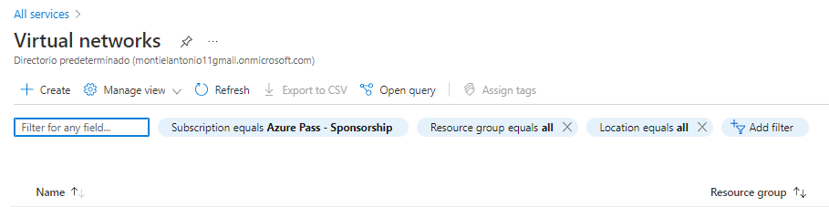
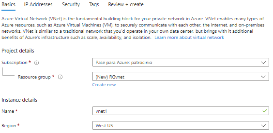
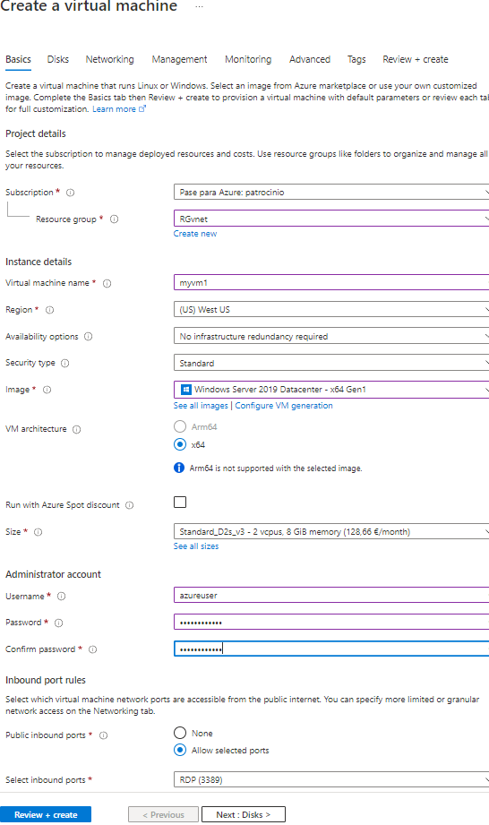

# Redes Virtuales Azure

A continuación mostraremos un guía para la realización de una red virtual en Azure, la cual constara con dos maquinas virtuales en las cuales comprobaremos su conexión haciendo ping entre ellas.

### PASO 1: Creación de la Red

**All Services -> Networking -> Virtual Network** y creamos así nuestra red:

| CONFIG                       | VALOR       |
| ---------------------------- | ----------- |
| Nombre                       | vnet1       |
| Espacio Direcciones          | 10.1.0.0/16 |
| Suscripción                  | Suscripción |
| Grupo de Recursos            | RGvnet      |
| Ubicación                    | East EEUU   |
| Subred - Nombre              | default     |
| Rango de dirección de subred | 10.1.0.0/24 |

Revisamos y creamos 

### PASO 2: Creación Maquinas Virtuales

Accederemos a **All Services -> Compute -> Virtual Machine** y crearemos las maquinas virtuales con la siguiente configuración

****

Crearemos la segunda máquina con la misma configuración

### PASO 3: Realizar la conexión entre las maquinas virtuales

Abrimos *Windows PowerShell*. Al probar la conexión, el ping no se llevara a cabo por al firewall, por lo que hay que ejecutar un comando para activar la regla y así poder conectar las máquinas.

Escribimos el siguiente comando:

*New-NetFirewallRule –DisplayName “Allow ICMPv4-In” –Protocol ICMPv4*

Podemos comprobar que la regla se ha ejecutado con éxito. Ahora comprobaremos la conexión haciendo ping entre las máquinas:

